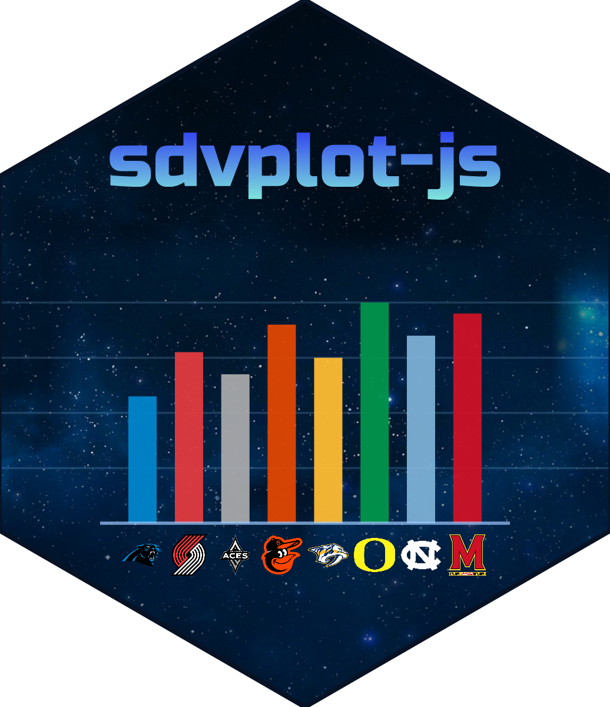

# sdvplot-js 

TypeScript ports of [sdvplot/sdvplotR](https://github.com/sportsdataverse) and sportyR/sportypy: team identity,
colors, logos, surfaces and tables for SportsDataverse plots.

## Packages

- `@sportsdataverse/sdvplot` - team identity, colors, logos and headshots
- `@sportsdataverse/sporty` - sport surfaces (geometry and dimensions)
- `@sportsdataverse/sdvtables` - table helpers

Docs site: <https://plot.sportsdataverse.org>

## Repository layout

- `packages/` - the three packages, each with its tests and public-API report (`etc/*.api.md`)
- `examples/` - every example the docs site shows, one module each; `pnpm test` runs them all
- `docs/` - the Docusaurus site: guides, the gallery and the typedoc API reference
- `notebooks/` - Observable Framework notebooks, built into the site at `/notebooks/`; a standalone npm app (the
  docs build runs `npm ci` there whenever its lockfile changes)
- `tools/` - the league-data index build, vendoring, codegen, parity oracles and brand assets
- `fixtures/` - real captured data the tests and examples read

## Toolchain

pnpm workspace, tsup, vitest, biome, api-extractor (public-type drift baseline in `packages/*/etc`),
attw + publint, changesets.

```bash
pnpm install
pnpm lint && pnpm typecheck && pnpm build && pnpm test && pnpm api:check && pnpm pack:check
```

After changing public types run `pnpm -r api:report` and commit the updated `etc/*.api.md`.

## Docs

Every example on the site runs in CI. `pnpm docs:build` first runs the examples gate: each example is executed
offline in Node (jsdom for the DOM), and one that throws, renders nothing, draws `NaN` or warns unexpectedly fails the
build. The same run writes the markup the pages serve, so nothing generated is committed. The build then adds the
notebooks and the Docusaurus site, and `check-build` confirms each inline output on a gallery page is the gate's.
CI also typechecks the site (`pnpm --filter docs typecheck`).

The Vercel build is pinned by `vercel.json` (install `pnpm install --frozen-lockfile`, build `pnpm docs:build`, output
`docs/build`), so the gate, the gallery and the notebooks run on every deploy. Vercel reads that file only when the
project's Root Directory is the repository root.

`pnpm --filter docs start` (the dev server) prerenders the examples but does not build the notebooks, so `/notebooks/`
is a 404 there. To preview the whole site, notebooks included, build it and serve the output:

```bash
pnpm docs:build && pnpm --filter docs serve
```

On Windows set `SKIP_HTML_MINIFICATION=true` for the build: the HTML minifier's native addon fails there (CI on Linux
is unaffected).

## Owner steps

- Create/own the `@sportsdataverse` npm org.
- Register each package on npmjs.com once and configure OIDC trusted publishing for
  `sportsdataverse/sdvplot-js` (workflow `release.yml`). Until then `changeset publish` fails at the publish
  step only.
- Upload `docs/static/img/social-card.png` as the repo's Social preview (Settings → General); GitHub has no
  API for it. `pnpm brand` regenerates it and the other brand assets (see `tools/brand/README.md`).

See [NOTICE.md](NOTICE.md) for licensing notes.
